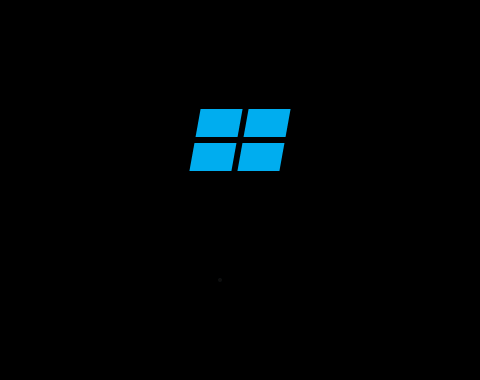

# Windows Yükleme Ekranı

Windows 10/11 açılış ekranının Processing (Java) ile yeniden yapılmış hali: perspektifli Windows logosu, beş noktalı dönen yükleme animasyonu ve yavaşça beliren "Lütfen Bekleyiniz" yazısı.

  

## Nasıl çalışır

- **Logo:** Dört paralelkenar, CSS'teki `rotateY` dönüşümünü taklit eden eğiklik (skew) değeriyle çiziliyor.
- **Noktalar:** Her nokta bir öncekinden 0,15 sn geride başlıyor. Bir döngü üç aşamadan oluşuyor:
  1. Saat 9 yönünden başlayan tam tur (`easeInOutSine`)
  2. Hızlanıp yavaşlayan 270°'lik ikinci tur; noktalar en altta kayboluyor
  3. Kısa bekleme ve noktaların yeniden belirmesi
- **Yazı:** Program başladıktan 0,5 sn sonra yavaşça görünür hale geliyor.

Zamanlama, renk ve boyut ayarları dosyanın başındaki değişkenlerden değiştirilebilir.

## Çalıştırma

1. [Processing](https://processing.org/download) programını kurun.
2. `WindowsLoadingScreen/WindowsLoadingScreen.pde` dosyasını açıp **Çalıştır**'a basın.

| Tuş | İşlev |
|---|---|
| `R` | Animasyonu baştan başlat |
| `Q` / `Esc` | Çık |

Program tam ekran açılır. Pencerede görmek için `setup()` içindeki `fullScreen();` satırını `size(800, 600);` ile değiştirin.

Proje raporu: [`docs/proje-raporu.docx`](docs/proje-raporu.docx)

## License

[MIT](LICENSE). Windows and the Windows logo are trademarks of Microsoft Corporation. This is an unofficial fan recreation for learning purposes.
